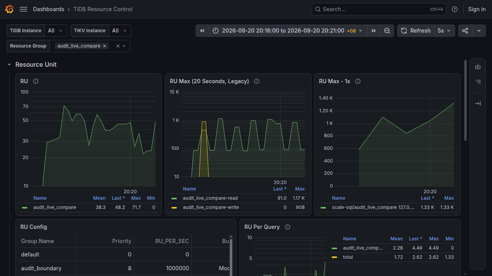

# Natural-second RU peak evidence

This branch contains test artifacts only. It is not part of the production PD pull request.

Related work: [PD #11256](https://github.com/tikv/pd/issues/11256), [KVProto #1539](https://github.com/pingcap/kvproto/pull/1539), [TiDB #71407](https://github.com/pingcap/tidb/issues/71407).

## Random-load measurement

The 2026-09-20 20:16–20:21 Asia/Singapore run used two TiDB SQL frontends, a real TiKV store, PD, Prometheus and Grafana on one host. A continuous four-query/s workload injected random read/write, staggered and single-node bursts. This measurement precedes the final disabled-mode allocation, scrape-lock and label cleanup; identities are preserved in `random-load/identity.json`.

12,144 confirmed accounting events produced five complete minute peaks. All five totals, RRU/WRU contributions and peak seconds matched the exporter, Prometheus and the actual Grafana datasource. Maximum absolute error was 7.503331289626658e-12 RU; maximum relative error was 7.171048438392994e-15. First exporter publication was 30.352–30.811 seconds after minute end, measured with a 0.5-second observer.

The independent reference groups the raw accounting events by `floor(time_ns / 1e9)`, sums signed RRU/WRU across both frontends with `math.fsum`, and selects each minute's earliest maximum. It does not read the transmitted buckets or metric values. It shares the producer's confirmed cost and accounting timestamp, so it verifies the monitoring pipeline, not the billing formula or physical TiKV execution time. Run `python3 verify.py` to repeat the offline comparison.

## A concrete difference from legacy Max RU

At 20:16:32 the logs recorded 338.4078125 WRU; at 20:16:33 they recorded 569.95 WRU. The legacy write Max later reported their sum, 908.3578125 WRU. The natural-second total peak was 578.599725744792 RU/s, equal to 569.95 WRU + 8.649725744792 RRU in 20:16:33. The legacy tracker accumulates arriving RPC deltas by PD tick rather than accounting second. Source inspection and the numeric equality support this explanation; RPC payloads were not independently logged.

The screenshot includes a temporary legacy comparison panel. The delivery dashboard replaces the original Max RU panel, preserves its ID and position, and uses the existing resource-group legend.

## Limits

This is a single-host, multiple-process real-cluster test. Known-source coverage, synchronized clocks, signed settlement, whole-minute completeness and the opt-in deployment contract still apply. Missing or unsupported sources must withhold a peak; absence must not be interpreted as zero. The protocol supplies no durable delivery or universal membership proof.
