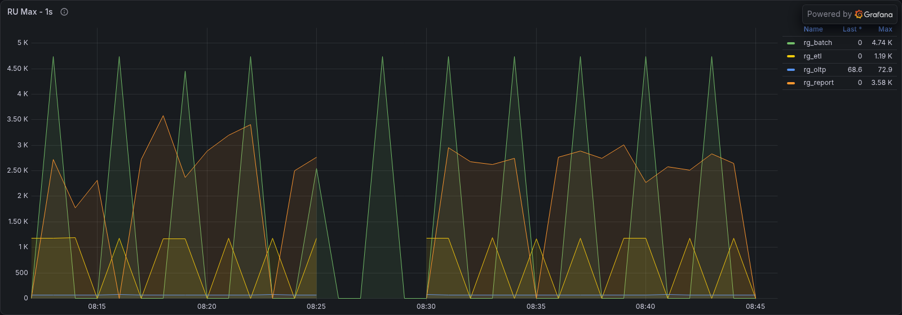
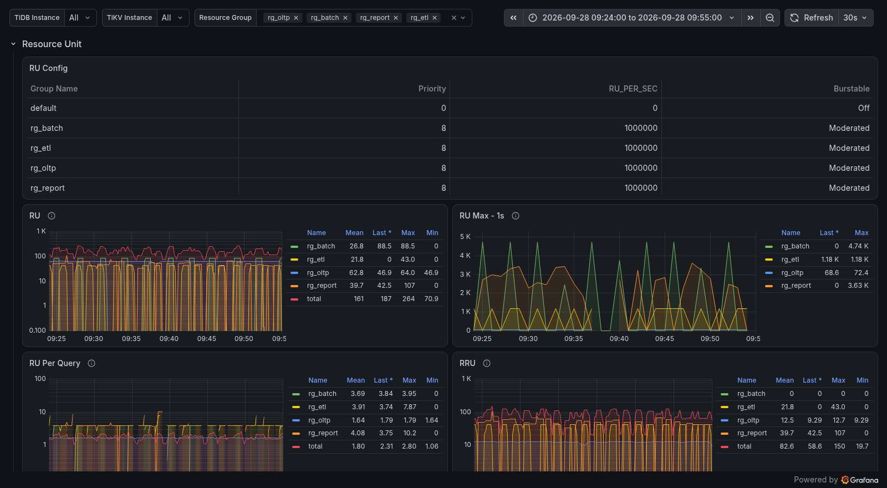
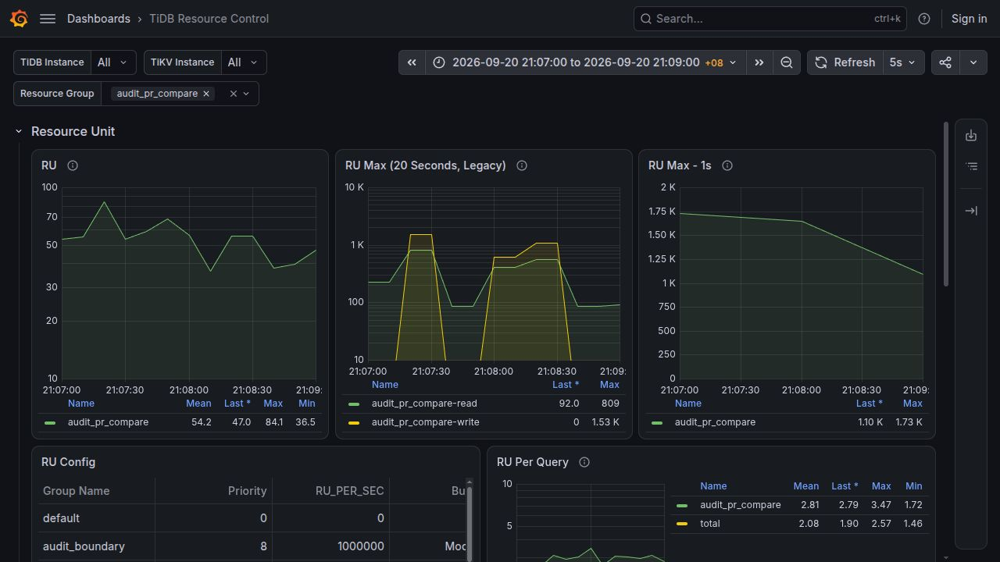
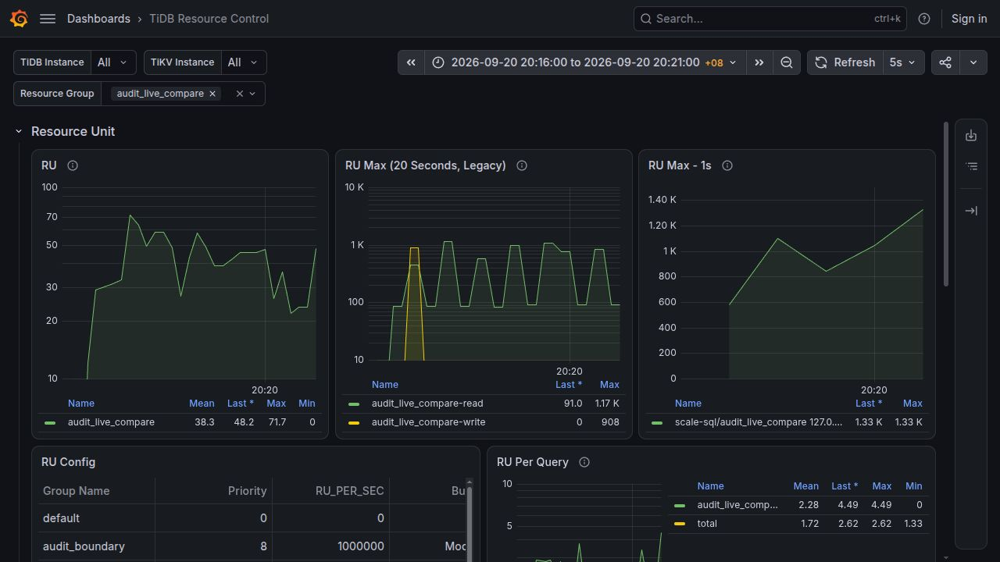

# Natural-second RU peak evidence

This branch contains test artifacts only. It is not part of the production PD pull request.

Related work: [PD #11256](https://github.com/tikv/pd/issues/11256), [KVProto #1539](https://github.com/pingcap/kvproto/pull/1539), [TiDB #71407](https://github.com/pingcap/tidb/issues/71407).

## Dashboard on the final implementation (2026-09-28)

A local NextGen cluster ran PD `182d5ca685` (tikv/pd#11293), TiDB built against PD client `11761f7521` (tikv/pd#11304) plus the idle-cleanup fix from tikv/pd#11308, a TiKV CSE store, Prometheus 3.14 and 2.55 scraping the same targets, and Grafana 13.2.2 with the Resource Control dashboard from TiDB `5dd5b26295` (pingcap/tidb#71408). [`load.py`](grafana-2026-09-28/load.py) drove four resource groups: `rg_oltp` steady on both TiDB nodes, `rg_batch` write bursts every three minutes on TiDB-a only, `rg_report` scan bursts starting in the same second on both nodes, and `rg_etl` scan bursts offset by 4–10 seconds between the nodes.

TiDB-b was killed with SIGKILL at 08:25:17 UTC and was ready again at 08:25:33. The minutes ending 08:26–08:29 have no sample for the groups it served, and `rg_batch`, served only by TiDB-a, continues. No other minute is missing from 08:12 to 08:46, no controller was recreated after 08:09, and the conflict, invalid-payload, missing-payload and capacity counters stayed at 0.

The panel sits beside RU, which shows average rates: `rg_batch` averages about 27 RU/s while its busiest seconds reach 4.74K RU/s.

The panel query shifts the range one second forward, `max_over_time(peak[$__interval] offset -1s) and count_over_time(peak[$__interval] offset -1s) == $__interval_ms / 60000`, so that it covers exactly the minutes ending in (t - interval, t]. [`check_query.py`](grafana-2026-09-28/check_query.py) compares it point by point with the raw samples: no mismatch on Prometheus 3.14 or 2.55 at one- and two-minute steps, while an unshifted `[$__interval]` range picks up the previous minute on 2.55 ([results](grafana-2026-09-28/query-check-final.txt)).

## Earlier submitted implementation (2026-09-20)

After the final PD leadership-handoff fix, the cluster ran PD `64efe953823230a8732eabc6499b02a8e30b5914`, KVProto `2a45fb4cd2dc77837ab4d068e7136f6d624e97d2`, and the TiDB source at `943f0e3859ab5e18622859a56d0759acb9104496`. TiDB uses a byte-identical copy of its checksum-verified PD client plus three test-only logging hooks. The server-only handoff fix does not change that client module. Production builds contain no audit hooks.

The 21:07–21:09 UTC+8 post-restart run contains **5,244 accounting events**. All **2/2 complete minute peaks**, components and timestamps matched independent log recomputation, the exporter, Prometheus and the Mac mini's actual Grafana datasource. Maximum absolute error: **2.114575181622058e-11 RU**, relative error **1.283728123477286e-14**. Publication was observed **30.465–30.607 seconds** after minute end. Capture errors: **0**.

| Minute end (UTC+8) | Log reference RU/s | Exported RU/s |
| --- | ---: | ---: |
| 21:08 | 1647.2141904114583 | 1647.2141904114794 |
| 21:09 | 1095.1532812447917 | 1095.1532812448015 |

The offline verifier checks both this final run and the earlier five-minute random run below. Raw inputs, outputs and exact runtime identities are stored separately for each run. The final lifecycle regression failed with races and lost publication before its fix; afterward it and the existing rapid-leader-campaign and TSO-proxy-shutdown race tests passed. Final PD make check and affected server-package race suites passed; TiDB bazel_prepare, lint, Classic and NextGen production builds passed. Remote CI status is reported on the PRs, not inferred from these local checks.

## Random-load measurement

The 2026-09-20 20:16–20:21 Asia/Singapore run used two TiDB SQL frontends, a real TiKV store, PD, Prometheus and Grafana on one host. A continuous four-query/s workload injected random read/write, staggered and single-node bursts. This measurement precedes the final disabled-mode allocation, scrape-lock and label cleanup; identities are preserved in `random-load/identity.json`.

12,144 confirmed accounting events produced five complete minute peaks. All five totals, RRU/WRU contributions and peak seconds matched the exporter, Prometheus and the actual Grafana datasource. Maximum absolute error was 7.503331289626658e-12 RU; maximum relative error was 7.171048438392994e-15. First exporter publication was 30.352–30.811 seconds after minute end, measured with a 0.5-second observer.

The independent reference groups the raw accounting events by `floor(time_ns / 1e9)`, sums signed RRU/WRU across both frontends with `math.fsum`, and selects each minute's earliest maximum. It does not read the transmitted buckets or metric values. It shares the producer's confirmed cost and accounting timestamp, so it verifies the monitoring pipeline, not the billing formula or physical TiKV execution time. Run `python3 verify.py` to repeat the offline comparison.

## A concrete difference from legacy Max RU

At 20:16:32 the logs recorded 338.4078125 WRU; at 20:16:33 they recorded 569.95 WRU. The legacy write Max later reported their sum, 908.3578125 WRU. The natural-second total peak was 578.599725744792 RU/s, equal to 569.95 WRU + 8.649725744792 RRU in 20:16:33. The legacy tracker accumulates arriving RPC deltas by PD tick rather than accounting second. Source inspection and the numeric equality support this explanation; RPC payloads were not independently logged.

The screenshot includes a temporary legacy comparison panel. The delivery dashboard replaces the original Max RU panel, preserves its ID and position, and uses the existing resource-group legend.

## Limits

This is a single-host, multiple-process real-cluster test. Known-source coverage, synchronized clocks, signed settlement, whole-minute completeness and the opt-in deployment contract still apply. Missing or unsupported sources must withhold a peak; absence must not be interpreted as zero. The protocol supplies no durable delivery or universal membership proof.
